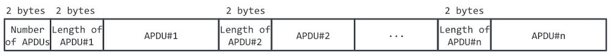
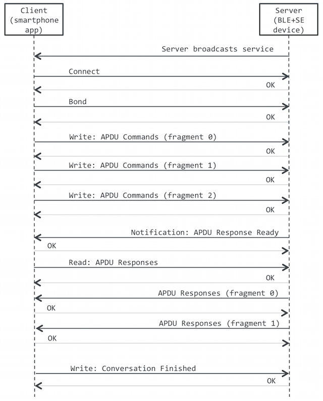

# APDU-Service specification

This document specifies the BLE service that transmits Command-APDUs from a smartphone to a BLE device that also contains a Secure Element.

## Roles
- A smartphone app will implement the *GATT Client* role.
- A BLE + SE device will implement the *GATT Server* role (also a BLE Peripheral)

## Pairing and Security
[bluetooth.org reference](https://developer.bluetooth.org/TechnologyOverview/Pages/LE-Security.aspx)
The device shall enforce Security Mode 1, Level 2 (unauthenticated pairing with encryption) before any messages containing APDUs are exchanged.

TO DO: check BLUETOOTH SPECIFICATION Version 4.2

## Client and Server requirements
Each role must support the following:

### GATT Server role
- Write characteristic value
- Read characteristic value
- Issue notifications

### GATT Client role
- Discover primary services by UUID
- Discover characteristics by UUID
- Read characteristic value
- Write characteristic value
- Receive notifications

## Service parameters

### Service UUID
`8e790d52-bb90-4967-a4a5-3f21aa9e05eb`

### Service Characteristics

| Characteristic name and description | Property | Length     | UUID                                   |
|-------------------------------------|----------|------------|----------------------------------------|
| APDU Commands                       | Write    | 512 bytes  | `9e73ecae-0701-403a-aefc-a1c5f6d16173` |
| Conversation Finished               | Write    | < 20 bytes | `a7fb8746-c1dc-47a3-b201-c17411617936` |
| APDU ResponsesReady                 | Notify   | NA         | `fbbe5e92-afdc-40ea-bada-aaf6f7bb8b01` |
| APDU Responses                      | Read     | 512 bytes  | `954727a7-5907-4377-8b5a-7d70951340a9` |

#### Characteristic: APDU Commands
Used by the Client to transmit a sequence of Command APDUs. The sequence is a serialized stream of APDUs following the structure below:



Both the number of APDUs and the length of each APDU are encoded using two bytes, so that the resulting value is:

```value = [byte 0] + [byte 1]*256```

#### Characteristic: Conversation Finished
Used by the Client to notify the Server that the APDU exchange has finished so the Server can power the device down.
The payload transmitted is irrelevant.

### Characteristic: APDU Responses Ready
Notification issued by the Server to signal that all the Command APDUs in the sequence have been processed, so the Response APDUs can be retrieved.

### Characteristic: APDU Responses
Used by the Client to retrieve the sequence of Response APDUs corresponding to the processing of a previous sequence of Command APDUs.
Response APDUs will be encoded in the same structure as command APDUs in the figure above.


## Packet and payload structure
APDU Commands and APDU Responses data may not fit into a single BLE packet, so they will have to be fragmented by the issuer and then reconstructed by the receiver. The APDU-Service will use the following packet structure:


which contains the following fields:
- `len`: total length of the packet
- `totn_pkt`: total number of packets (fragments) for this APDU sequence
- `pkt_nbr`: sequence number of the packet
- `data`: payload. Fragment of the APDU Commands/Responses sequence

The three unsigned integer fields `len`, `totn_pkt` and `pkt_nbr` are encoded in two bytes, using the same scheme as the fields in the APDU sequence above:

```value = [byte 0] + [byte 1]*256```

## Sequence diagram
Example of an exchange of Command and Response APDUs:



