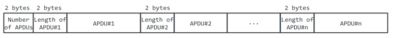
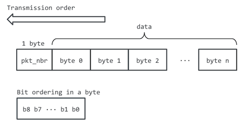

# APDU-Service specification

This document specifies the BLE service that transmits Command-APDUs from a smartphone to a BLE device that also contains a Secure Element.

## Roles
- A smartphone app will implement the *GATT Client* role.
- A BLE + SE device will implement the *GATT Server* role (also a BLE Peripheral)

## Pairing and Security
[bluetooth.org reference](https://developer.bluetooth.org/TechnologyOverview/Pages/LE-Security.aspx)
The device shall enforce Security Mode 1, Level 2 (unauthenticated pairing with encryption) before any messages containing APDUs are exchanged.

It is strongly encouraged to define an *application-level pairing* mechanism to make sure that only authorized applications may send APDU Commands to the device containing the Secure Element.

## Client and Server requirements
Each role must support the following:

### GATT Server role
- Write characteristic value
- Read characteristic value
- Issue notifications

### GATT Client role
- Discover primary services by UUID
- Discover characteristics by UUID
- Read characteristic value
- Write characteristic value
- Receive notifications

## Service parameters

### Service UUID
`8e790d52-bb90-4967-a4a5-3f21aa9e05eb`

### Service Characteristics

| Characteristic name                 | Property        | Length     | UUID                                   |
|-------------------------------------|---------------- |------------|----------------------------------------|
| APDU Commands                       | Write with ACK  | 512 bytes  | `8e79ecae-bb90-4967-a4a5-3f21aa9e05eb` |
| Conversation Finished               | Write with ACK  | < 20 bytes | `8e798746-bb90-4967-a4a5-3f21aa9e05eb` |
| APDU Responses Ready                | Notify with ACK | NA         | `8e795e92-bb90-4967-a4a5-3f21aa9e05eb` |
| APDU Responses                      | Read            | 512 bytes  | `8e7927a7-bb90-4967-a4a5-3f21aa9e05eb` |
| Max Memory for APDU processing      | Read            | <20 bytes  | `8e79e13b-bb90-4967-a4a5-3f21aa9e05eb` |

#### Characteristic: APDU Commands
Used by the Client to transmit a sequence of Command APDUs. The sequence is a serialized stream of APDUs following the structure [below](#packet):



Both the number of APDUs and the length of each APDU are encoded using two bytes, so that the resulting value is:

```value = [byte 0] + [byte 1]*256```

The sequence of APDUs is then divided into packets that fit into the maximum length for this characteristic, following the structure described below.

#### Characteristic: Conversation Finished
Used by the Client to notify the Server that the APDU exchange has finished so the Server can power the device down.
The payload transmitted is irrelevant.

#### Characteristic: APDU Responses Ready
Notification issued by the Server to signal that all the Command APDUs in the sequence have been processed, so the Response APDUs can be retrieved. The payload transmitted is irrelevant.

#### Characteristic: APDU Responses
Used by the Client to retrieve the sequence of Response APDUs corresponding to the processing of a previous sequence of Command APDUs. The Client will read this characteristic only after receiving *APDU Responses Ready* notification. Response APDUs will be encoded in the same structure as command APDUs in the figure above.

#### Characteristic: Max Memory for APDU processing
Memory, in kilobytes, that the Server can use to store APDU Commands. This limits the number of APDU Commands that can be sent by writing to the *APDU Commands* characteristic.
This characteristic is optional. If missing, the Server indicates that it does not have any memory limitations, so the Client does not need to limit the number of Command APDUs sent in a sequence.
Payload: memory (in bytes), coded as a 32-bit unsigned integer.

## <a name="packet"></a> Packet and payload structure
APDU Commands and APDU Responses data may not fit into a single BLE packet, so they will have to be fragmented by the issuer and then reconstructed by the receiver. The APDU-Service will use the following packet structure:


which contains the following fields:
- `totn_pkt`: total number of packets in the APDU Commands/Responses sequence
- `pkt_nbr`: position of the packet (in the sequence)
- `data`: payload. Fragment of the APDU Commands/Responses sequence

The data follows a big-endian byte order (byte 0 sent first), and little endian bit order in each byte:




The packet's length will always be the maximum size allowed by the `APDU Commands` characteristic, except for the last packet, that might be shorter.

## Packet ordering and retry policy

BLE guarantees ordered packet delivery, so it is not necessary to specify when to retry transmission, detect duplicates, etc.

## Maximum length of sequences, commands and packets (informative)
This section explains how the different frames are split in lower-layer packets, and how the maximum lenght of each is specified.
- APDU Sequence: frame that groups several APDU commands or responses. Its maximum length is defined by the characteristic `Max Memory for APDU processing`.
- APDU Commands packet: section of the APDU Sequence that fits in a single BLE operation. Its maximum size is the length of the `APDU Commands` write characteristic.
- BLE packet: data fragment actually transmitted by the lower layers of the BLE stack. Its maximum size is defined by the MTU size negotiated between the BLE client and server. Fragmentation, ordering and reconstruction are done transparently, so there is no need to specify them in this document. 


## Sequence diagram

### Commands

When sending a sequence of Command APDUs, the Client sends the different fragments in order, waiting for the ACK from the Server (sent by lower layers of the BLE stack). 

### Responses

When the Server has finished processing the Command APDUs, it issues an `APDU Responses Ready` notification. Then the Client will fetch the first fragment of the sequence of Response APDUs by reading the `APDU Responses` characteristic.

Example of an exchange of Command and Response APDUs:


