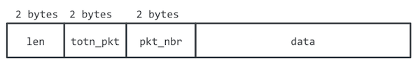

# APDU-over-BLE service specification v0.2

This document specifies a [BLE GATT](https://www.bluetooth.com/specifications/gatt/generic-attributes-overview) service that allows to transmit [APDU](https://en.wikipedia.org/wiki/Smart_card_application_protocol_data_unit)-s betweeen a BLE client device and a BLE server device that contains a Secure Element.

#### Version history
- v0.2 adds error notifications and removes multiple APDU support from the protocol

#### Requirements
The key words "MUST", "MUST NOT", "REQUIRED", "SHALL", "SHALL NOT", "SHOULD", "SHOULD NOT", "RECOMMENDED",  "MAY", and "OPTIONAL" in this document are to be interpreted as described in [RFC 2119](https://tools.ietf.org/html/rfc2119).

## Roles
- The BLE client device (for example, a smartphone app) will implement the *GATT Client* role.
- A BLE + SE device will implement the *GATT Server* role (also known as *BLE Peripheral*)

## Pairing and Security
[bluetooth.org reference](https://developer.bluetooth.org/TechnologyOverview/Pages/LE-Security.aspx)
The device shall enforce Security Mode 1, Level 2 (unauthenticated pairing with encryption) before any messages containing APDUs are exchanged.

It is strongly encouraged to define an *application-level pairing* mechanism to make sure that only authorized applications may send APDU Commands to the device containing the Secure Element.

Please see [Security Considerations](./security-considerations.md) for more information on

## Client and Server requirements
Each role must support the following:

### GATT Server role
- Reading characteristic value
- Writing characteristic value
- Issuing notifications

### GATT Client role
- Discovering primary services by UUID
- Discovering characteristics by UUID
- Reading characteristic value
- Writing characteristic value
- Receiving notifications

## Service parameters

### Service UUID
`8e790d52-bb90-4967-a4a5-3f21aa9e05eb`

### Service Characteristics

| Characteristic name                 | Property        | Length       | UUID                                   |
|-------------------------------------|---------------- |--------------|----------------------------------------|
| APDU Command                        | Write with ACK  | 1..MTU bytes | `8e79ecae-bb90-4967-a4a5-3f21aa9e05eb` |
| APDU Response Ready                 | Notify          | 4 bytes      | `8e795e92-bb90-4967-a4a5-3f21aa9e05eb` |
| APDU Response                       | Read            | 1..MTU bytes | `8e7927a7-bb90-4967-a4a5-3f21aa9e05eb` |
| Close Communication                 | Write with ACK  | 4 bytes      | `8e798746-bb90-4967-a4a5-3f21aa9e05eb` |

#### Characteristic: APDU Command
Used by the Client to transmit a Command APDU, fragmented into messages that fit the established BLE MTU.

APDU is divided into packets following the structure [below](#packet).

#### Characteristic: APDU Response Ready
Notification issued by the Server to signal that the Response APDU can be retrieved or an error code.

The payload has to be a 32-bit unsigned big endian integer, denoting:
  - `0x000000000`: No error, APDU is ready for reading
  - `0x000000001`: Generic SE error (no response from SE, transaction reset)
  - `0x000000002`: APDU-over-BLE protocol error (packets lost, incorrect sequence, timeout)

#### Characteristic: APDU Response
Used by the Client to retrieve the Response APDU fragments corresponding to the processing of a previous Command APDU. The Client will read this characteristic only after receiving *APDU Response Ready* notification. Response APDU fragments will be encoded in the same structure as command APDUs in the figure below.

#### Characteristic: Conversation Finished
Used by the Client to notify the Server that the APDU exchange has finished so the Server can power the device down.
The payload has to be `0` coded as 32-bit unsigned integer.

## <a name="packet"></a> Packet and payload structure
APDU Command or APDU Response may not fit into a single BLE packet (with a default [useful payload of only 23 bytes](https://punchthrough.com/pt-blog-post/maximizing-ble-throughput-part-2-use-larger-att-mtu/) when standard MTU is used), so they will have to be fragmented by the issuer and then reconstructed by the receiver.

The APDU-Service will use the following packet structure:



which contains the following fields:
- `totn_pkt`: total number of packets in the APDU Command/Response
- `pkt_nbr`: position of the packet (in the sequence)
- `data`: payload. Fragment of the APDU Command/Response

The data follows a big-endian byte order (byte 0 sent first), and little endian bit order in each byte:


## Packet ordering and retry policy

BLE guarantees ordered packet delivery, so it is not necessary to specify when to retry transmission, detect duplicates, etc.

If a client device does not for some reason send a APDU Response request, the server SHOULD re-send the notification until APDU Response characteristic is read, or until a application-specific timeout occurs.

## Sequence diagram
Interaction can be explained with this WebSequenceDiagram:


```
title APDU-over-BLE

participant "Mobile App" as Client
participant "BLE Peripheral" as Server
participant "Secure Element" as SE

alt Bluetooth connection
Server->Client: Advertise service
Client->Server: Connect
Server-->Client: ACK
Client->Server: Bond
Server-->Client: ACK
end
loop Multiple APDUs

loop APDU to BLE Peripheral 1..N
Client->Server: Write: "APDU Command" with fragment N
Server-->Client: ACK
end
note right of Server: BLE peripheral MAY power up SE

alt APDU to Secure Element
Server->SE: CommandAPDU
SE->Server: ResponseAPDU
Server-->>SE: 0x61XX / 0x6CXX handling
SE-->>Server: ResponseAPDU
end

Server->Client: APDU Response Ready Notification

loop APDU to Client 1..N
Client->Server: Read: "APDU Response"
Server-->Client: ResponseAPDU fragment N
end

alt In case of error
Server-->Client: Notify with error code
end
end
Client->Server: Write: "Conversation Finished"
note right of Server: BLE peripheral MAY power down SE
Server-->Client: ACK


```
### Command

When sending a Command APDU, the Client sends the different fragments in order, waiting for the ACK from the Server (sent by lower layers of the BLE stack).

### Response

When the Server has finished processing the Command APDU, it issues an `APDU Response Ready` notification. Then the Client will fetch the first fragment of the sequence of Response APDUs by reading the `APDU Response` characteristic and continues reading until the full Response APDU has been read.

Any time during the BLE conversation can an `Error` notification be sent and the state of the BLE Peripheral to be reset.
